

**Data Engineer · Backend Developer**

<a href="https://www.instagram.com/nicolasisepe/">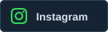</a>
<a href="mailto:nicolasisepe@gmail.com">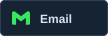</a>

---

## About me

I'm Nicolas, a 16-year-old developer working as a **Data Engineer at Wild Fork Foods since 2025**. I map business processes and trace how data moves through them, identifying redundant steps and opportunities to make workflows more efficient. My day-to-day tools include **Qlik, Snowflake, and dbt**.

My interests span both backend and frontend development. Right now, I'm focusing on **backend development**, building projects with **FastAPI** and exploring how APIs and databases work together.

## Some Projects

### [Athena — Accessible art commerce](https://github.com/athena-ecommerce-)

A school project exploring accessibility in digital products through an e-commerce platform for selling artwork. **I contributed to the development of the API endpoints.**

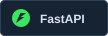
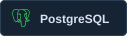
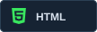
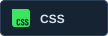
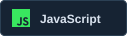

### [Mini Inter — School management](https://github.com/Mini-Inter-)

A school management platform developed as a school project, connecting a Java Servlet backend and a PostgreSQL database to a web interface.

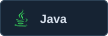
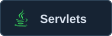

### [IARA — From photos to inspection data](https://github.com/IARA-1-ano-)

A school project aligned with **SDG 9: Industry, Innovation and Infrastructure**. Our team addressed the manual reading of an inspection tally board used in a Federal Inspection Service (SIF) workflow, a task performed every 15 minutes.

We developed a solution using an image-capable language model to interpret each row of the board from a photograph and calculate its totals, automating the reading and calculation process.

`Multimodal AI` · `Image interpretation` · `Process automation`

## Technologies & tools

### Languages

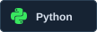

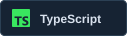
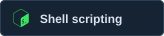

### Backend

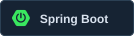

### Frontend

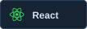

### Databases

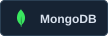
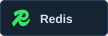

### Data & AI

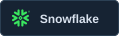
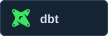
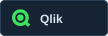
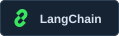

### Systems & version control

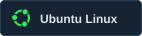
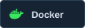
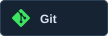
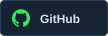

### Design & development tools

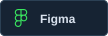
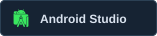
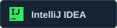

## GitHub activity

  
  

Language distribution reflects code in public repositories, not proficiency.

<!-- Stats are externally hosted; logos and banner are included locally. Stats availability and refresh timing depend on the provider. -->

---

**Let's connect.**

